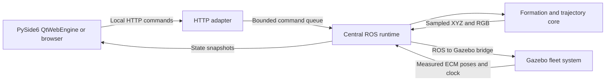

# Architecture

AEROS separates show design, deterministic planning, ROS transport, Gazebo state and rendering. The desktop is a client: it does not advance a private simulation when the backend is disconnected.

## Modules and ownership

| Path | Responsibility |
| --- | --- |
| `image_processing/pipeline.py` | Bounded decoding, image masks, unique samples, RGB and preview |
| `formations/basic.py` | Ground grid, circle, star, spiral, wave and infinity targets |
| `motion/fleet_trajectory.py` | Assignment, continuous separation certificate and synchronized trajectories |
| `swarm/fleet.py` | Mission state, queued edits, targets and image lifetime |
| `swarm/separation.py` | Endpoint depth layers for dense patterns |
| `swarm/lighting.py` | Single/image colors and animated effects |
| `ros_nodes/fleet_runtime.py` | Clock, transport, command dispatch and measured telemetry |
| `gazebo_plugin/` | Owned-model pose updates, measured feedback and LED materials |
| `gui/server.py`, `gui/main_window.py`, `gui/web/` | Local API, native window and Three.js viewer |

Python paths above are relative to `drone_swarm/`. The ROS package is `drone_swarm_simulator`; its installed Python module is `drone_swarm`. The Gazebo system is a separately built C++17 library.

## Image to target points

PNG/JPEG headers are checked before decoding: at most 8 MiB encoded, 16 megapixels and 8192 pixels on either side. OpenCV processes an image at up to 512 pixels on its longer side. Edge mode uses grayscale and color-channel Canny contours, preserving internal details; filled mode uses a threshold with automatic border-background polarity. Invert reverses threshold polarity in filled mode. Intensity inversion often leaves edge geometry unchanged.

Deterministic farthest-point sampling chooses exactly N distinct usable pixels from a bounded candidate set. Insufficient detail produces an error instead of duplicate drone coordinates. Each sample carries a source RGB color and a preview point. Mapping preserves aspect ratio, centers X, reverses image-row direction into Z and places the pattern in a vertical X/Z plane around the configured altitude.

With avoidance enabled, a proximity graph identifies targets whose front-view spacing is too small. Deterministic greedy coloring assigns them separate Y layers with the required clearance. X/Z remains unchanged, so the front-view artwork is preserved; side views reveal its depth. This establishes endpoint feasibility before transit planning.

## Assignment and continuous paths

The planner solves a squared-Euclidean Hungarian assignment, with O(N³) assignment cost and O(N²) pair checks. For each pair, its relative position along a common linear interpolation is `a + u b`. The exact closest parameter is `u* = clip(-a·b / (b·b), 0, 1)`, with stationary relative pairs handled separately. This gives a continuous minimum-distance certificate rather than a sampled guess.

An optimal squared-distance assignment makes the dot product of each assigned pair's start and target relative vectors nonnegative. For separated endpoints this bounds how much the straight morph can compress. If its certificate is below the configured distance, the planner uses three common stages: **expand, morph, contract**. Expansion pivots at the cloud's horizontal center and Z=0.5 m, preserving the ground floor. The expansion factor is chosen from the analytical closest-distance result and checked again on the actual expanded coordinates.

Each stage uses cubic smoothstep `s(u)=3u²−2u³`. Its peak speed is `1.5 × path length / stage duration`. Stage durations are allocated by their largest drone path length; the requested total duration is extended when needed. Every drone shares each stage's timing, and stage endpoints have zero velocity. Position/velocity sampling is O(N). The generic planner accepts up to 500 points; the product, configuration and Gazebo transport limit active drones to 400.

The certificate describes reference trajectories with valid separated endpoints. Actual simulator tracking is measured independently. Disabling avoidance removes the separation requirement. This algorithm does not plan around buildings, terrain obstacles or physical rotor envelopes.

## State and edits

The normal sequence is `IDLE → TAKEOFF → TRANSITIONING → FORMATION_COMPLETE`, with `ANIMATING` for time-varying lighting. `PAUSED` freezes mission progress while Gazebo's clock continues. Resume continues the route. Stop holds the current references and clears queued motion. Reset recreates the ground grid while retaining settings and the uploaded image.

Formation and motion-setting edits during movement are queued until the next completed formation boundary. This avoids replacing a moving trajectory with a discontinuous reference. Color and brightness edits can apply immediately. Count and minimum-separation changes require an idle/stopped show and rebuild the ground grid; these are scene resets, not flight maneuvers.

`full_system.launch.py` pre-spawns 400 static models. The active set can change within that capacity; inactive models are parked out of view. `swarm.launch.py` can instead allocate only a smaller capacity for focused tests.

## ROS and Gazebo contract

| Topic | ROS type | Meaning |
| --- | --- | --- |
| `/clock` | `rosgraph_msgs/msg/Clock` | Gazebo simulation time |
| `/swarm/reference` | `tf2_msgs/msg/TFMessage` | Desired world positions, ROS → Gazebo |
| `/swarm/poses` | `tf2_msgs/msg/TFMessage` | Measured world positions, Gazebo → ROS |
| `/swarm/colors` | `tf2_msgs/msg/TFMessage` | RGB batch, ROS → Gazebo |
| `/swarm/command` | `std_msgs/msg/String` | Action string or JSON command |
| `/swarm/state` | `std_msgs/msg/String` | JSON state and measured telemetry |

The bridge maps the three batch topics to `gz.msgs.Pose_V`. These are application-specific messages, not entries in the global `/tf` tree. Every entry carries `header.frame_id=world` and `child_frame_id=drone_NNN`; identities and finite values are validated atomically.

The generated fleet world explicitly omits the Physics system. It retains a 120 Hz timing profile: Gazebo's SimulationRunner owns timestep progression and clock publication independently of the dynamics plugin. UserCommands and SceneBroadcaster remain installed. This is a requested schedule; actual real-time factor is measured. [Gazebo 8.11 SimulationRunner](https://github.com/gazebosim/gz-sim/blob/gz-sim8_8.11.0/src/SimulationRunner.cc).

In PreUpdate, the fleet plugin writes each owned, direct-world static model's Pose component and marks changed poses as `PeriodicChange`. It leaves link and visual poses local to their parent, so the whole drone moves together. SceneBroadcaster sends those component updates and RenderUtil applies model poses to its rendering hierarchy. The dynamics engine and its pose-command/free-group processing are not involved. [Gazebo 8.11 scene broadcasting](https://github.com/gazebosim/gz-sim/blob/gz-sim8_8.11.0/src/systems/scene_broadcaster/SceneBroadcaster.cc), [renderer updates](https://github.com/gazebosim/gz-sim/blob/gz-sim8_8.11.0/src/rendering/RenderUtil.cc).

PostUpdate reads the resulting `worldPose` from Gazebo's entity-component manager; it does not echo a buffered command message. `worldPose()` composes Pose and ParentEntity components, so no separate WorldPose component is required for this sensorless fleet. Feedback must contain a complete, fresh active fleet with consistent timestamps before runtime readiness is established. This readback confirms simulator state, not an independent flight-dynamics response. [Gazebo 8.11 worldPose implementation](https://github.com/gazebosim/gz-sim/blob/gz-sim8_8.11.0/src/Util.cc#L64).

RGB uses translation components for values in [0,1] and an identity quaternion. The current runtime publishes colors at about 10 Hz; the plugin can accept faster input while coalescing to at most 10 material updates per simulated second. A batch must match the full active ID set. Only each owned `base_link/show_light` visual is changed, using persistent Material state and the supported VisualCmd renderer path. No extra shadow-casting lights are created per drone. [Gazebo VisualCmd definition](https://github.com/gazebosim/gz-sim/blob/gz-sim8/include/gz/sim/components/VisualCmd.hh).

## HTTP, rendering and telemetry

The local server serves the vendored Three.js modules and the UI. `GET /api/state` returns a cached snapshot, `GET /api/sample` returns the bundled image, and `POST /api/command` accepts an action object. HTTP handlers submit work to a bounded queue; the ROS executor owns mutations. Invalid input, queue saturation, shutdown and response timeouts return explicit errors. Host/origin checks restrict the interface to local, same-origin use; it is not a public multiuser service.

The viewer renders measured `positions`. Desired positions remain separately labeled in telemetry for tracking diagnostics. RGB in the viewer comes from the controller and is identified as such; it is not an optical measurement of Gazebo's renderer.

Speed derives from consecutive measured poses and their simulation timestamps. Separation uses measured positions, tracking error compares measured and desired positions, and feedback age uses wall time. Real-time factor is advancing simulator time divided by wall time. Control rate and received pose rate are measured separately. Viewer FPS comes from animation-frame timing and is never assumed to be 60.

Simulation time advances the mission, while wall-clock watchdogs detect absent or frozen feedback. Runtime errors stop reference progression; the UI reports the failure rather than simulating success locally.

## Fidelity and legacy demo

The fleet model is deliberately kinematic: static bodies follow references with the Physics system disabled, without motor, lift, aerodynamic, wind or autopilot dynamics. This uses the brief's reduced-physics option for the 400-model visualization workload; 400-drone real-time acceptance remains a separate measured gate. PX4/SITL remains a future adapter behind the backend boundary.

The retained Phase 1 launch keeps its Physics system and uses one drone with gravity disabled, a velocity-control system and an odometry publisher. Its separate topics are `/drone_001/cmd_vel`, `/drone_001/odometry` and `/swarm/telemetry`. Its route rises to 4 m, visits `(3,2,4)`, returns to `(0,0,4)` and holds. Do not run the legacy and fleet controllers in the same ROS/Gazebo discovery domain.
