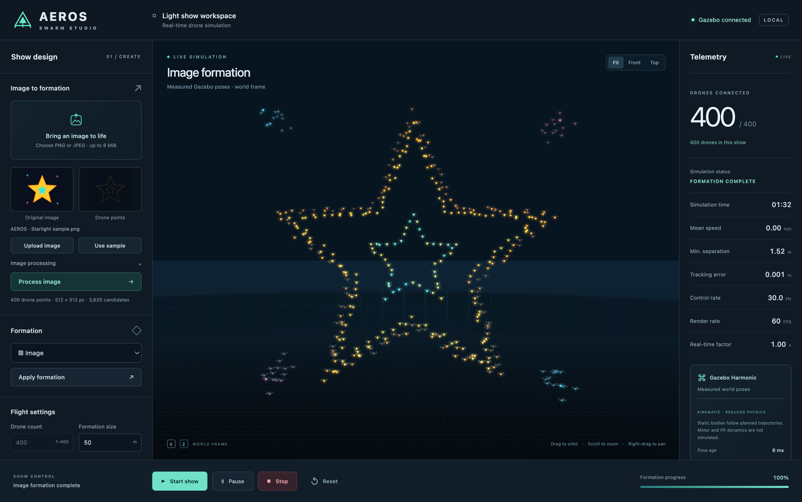

# Real-Time Dynamic Drone Swarm Formation and Visual Pattern Generation System

**AEROS — Swarm Studio** turns PNG/JPEG images into colored drone formations. A native PySide6 desktop window or local browser provides the controls and Three.js 3D view; ROS 2 and Gazebo run the simulation in a Linux container. The fleet supports 1–400 active drones.

Create circle, star, spiral, wave, infinity and image formations; adjust flight settings; animate LED colors; and inspect measured positions, speed, separation and simulator timing. Implementation and verification are tracked separately in [DEVELOPMENT_PROGRESS.md](DEVELOPMENT_PROGRESS.md). Refer to its linked reports for completed scale and GUI acceptance gates—supporting 400 models does not by itself establish a measured performance result.



The final native desktop workflow, full API workflow and independent Gazebo LED checks passed. See the [validation record](artifacts/full-validation.md) for evidence and measurement limits.

## Start the application

On the development Mac, start Docker Desktop or Colima and use a supported Python installation. For the full 400-model world, we recommend **4 CPUs and 6 GiB RAM for Docker's Linux VM**, the allocation used for the successful validation. An earlier application container was OOM-killed in a 2 GiB/2-CPU Colima VM; the recommendation is not a measured minimum. From this repository:

```bash
bash scripts/install_desktop.sh
docker build -t drone-swarm:latest -f docker/Dockerfile .
bash scripts/start.sh
```

After installation, **`bash scripts/start.sh`** starts the complete application. It launches a 400-capacity Gazebo world, exposes the local interface at **http://127.0.0.1:8765** and waits for measured fleet connectivity before opening the desktop window. The show starts when you press **Start show**. The first launch builds the image automatically if it is absent.

```bash
bash scripts/start.sh --browser
bash scripts/start.sh --headless --count 100
bash scripts/stop.sh
```

Browser mode uses the same workspace without requiring PySide6. Headless mode starts the backend and HTTP service without opening a window. Closing a viewer leaves the simulator running; `stop.sh` stops the application container. A running container is reused only with the current image; stop it before changing launch options. Failed containers retain their logs, and startup failures are copied to `artifacts/last-session.log`. See [INSTALLATION.md](INSTALLATION.md) for dependencies and native Ubuntu setup.

**A lower active count does not reduce full-app capacity:** `--count 20` still allocates 400 Gazebo models. For a smaller world on a constrained machine, use the [explicit count/capacity launch](INSTALLATION.md#smaller-worlds-on-constrained-machines).

## Make a light show

1. With **Circle** selected, press **Start show**. Wait for the drones to take off and settle into the circle.
2. Choose **Use sample**, or upload a PNG/JPEG. Inspect the source and colored point preview. Change extraction mode, threshold or inversion and select **Process image** when needed. Successful processing automatically selects **Image** formation.
3. Press **Apply formation** to move into the image. Select **Image colors** and **Apply settings** to use sampled source colors.
4. Try **Spiral**, then **Rainbow**, **Pulse**, **Color wave**, **Blink** or **Fade**. Drag to orbit, scroll to zoom, or use **Front**, **Top** and **Fit**.
5. Use **Pause** and **Resume** to hold and continue. To change drone count or minimum separation, press **Stop**, edit the values and apply settings; this resets the fleet to its ground grid. Press **Start show** again.

Formation and motion-setting edits made during motion wait for the next formation boundary. Color and brightness edits apply immediately. **Stop holds the current positions; it does not land. Reset returns the fleet to its ground grid, keeps the uploaded image and retains settings.**

Uploads are limited to 8 MiB, 16 megapixels and 8192 pixels per side, with dimensions checked before decoding. Edge and filled extraction produce exactly the requested number of distinct points or return an error. Image aspect ratio and source colors are preserved. With avoidance enabled, dense targets gain Y-depth layers while their front X/Z projection stays unchanged.

## Defaults and simulation fidelity

[config/swarm.json](config/swarm.json) supplies the full application defaults: **400 drones, 50 m size, 35 m altitude, 10 s requested transition, 5 m/s maximum reference speed, 1.5 m minimum separation**, avoidance enabled and cyan lighting. A transition can take longer than requested to satisfy the speed bound and safe path geometry.

The fleet backend uses **static Gazebo models with its Physics system explicitly disabled**. The fleet plugin updates owned model Pose components directly; Gazebo's SimulationRunner still owns the world, clock and 120 Hz update schedule. Feedback reads the resulting world poses from Gazebo's entity-component state, and the viewer displays those observations. The 120 Hz schedule is a target, not a measured real-time result.

This reduced-physics choice supports the brief's fleet visualization workload without running unused dynamics. Rotor thrust, aerodynamics, wind, autopilot behavior and flight stability are not simulated. PX4/SITL is a future backend adapter. The original one-drone velocity demo retains its separate Physics system. This is a formation and visualization simulator, not a physical-flight validation tool.

Separation is certified for the continuous planned reference path. Actual Gazebo separation and tracking error are reported separately. The desktop displays controller RGB commands; the Gazebo plugin also updates the actual models' emissive LED materials.

## Verification and project guide

```bash
.venv/bin/python -m unittest discover -s tests -v
.venv/bin/python scripts/benchmark_core.py
docker run --rm drone-swarm:latest env SWARM_TEST_MODE=fleet SWARM_TEST_COUNT=5 bash scripts/run_integration.sh
```

The benchmark measures CPU algorithms only. Render FPS comes from the viewer's measured animation-frame rate; control rate, received pose rate and real-time factor are separate metrics. See [DEVELOPMENT.md](DEVELOPMENT.md) for scale/image integration commands and evidence requirements.

The optimized 400-drone headless image/star run completed at **0.9938× real time and 29.77 pose batches/s**. The final native desktop exercise passed all six checks and reported **60 FPS at its final observation**. See [PERFORMANCE.md](PERFORMANCE.md) for hardware, measurement limits and the distinction between bounded reference speed and observed batch motion.

| Guide | Contents |
| --- | --- |
| [Installation](INSTALLATION.md) | Desktop, browser, Docker and Ubuntu setup |
| [Architecture](ARCHITECTURE.md) | Image processing, planning, transport and feedback contracts |
| [Development](DEVELOPMENT.md) | Tests, benchmarks, integration reports and rebuilding |
| [Performance](PERFORMANCE.md) | Measured scale results, optimization history and limits |
| [Troubleshooting](TROUBLESHOOTING.md) | Startup, image, connection, rendering and Docker issues |
| [Acceptance progress](DEVELOPMENT_PROGRESS.md) | Current verification gates and measured reports |
| [Requirements audit](REQUIREMENTS_AUDIT.md) | Remaining specification gaps and deliberate simplifications |

The original Phase 1 one-drone velocity demo remains available:

```bash
docker run --rm -it drone-swarm:latest ros2 launch drone_swarm_simulator simulation.launch.py gui:=false auto_demo:=true
```

It uses a separate reduced-physics model with gravity disabled and a velocity controller. Its verified communication and waypoint tests are preserved in [artifacts/validation.md](artifacts/validation.md). Project code is MIT licensed; bundled dependencies retain their own licenses.
